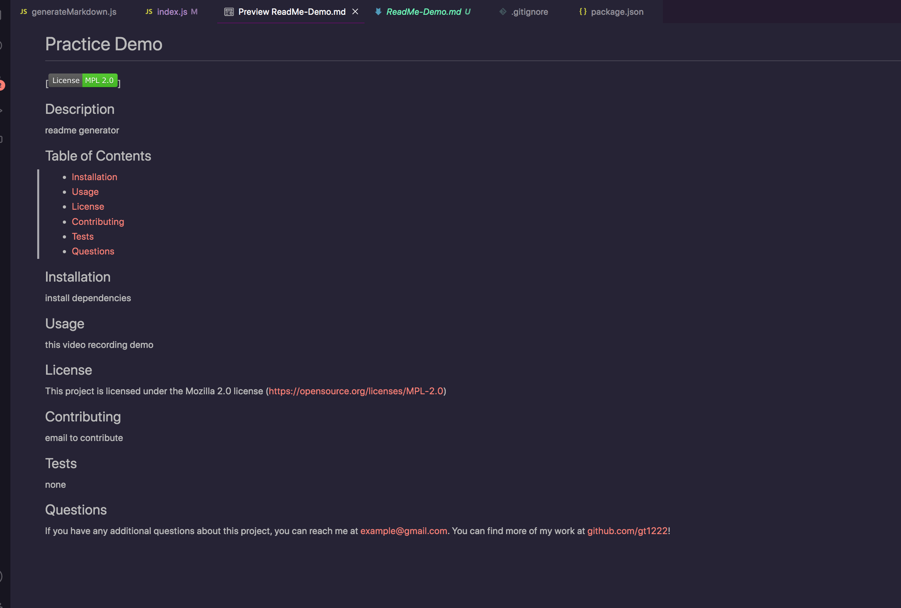

# ReadMe-Generator

## Description
I really enjoyed working on this project. I'm super happy with my results and the work I put into this. I did struggle a bit with a couple of functions, for example, the init function. I wasn't sure how to incorporate `inquirer.prompt` into the function and call the `questions array`. However, once I looked at a couple documentations and examples online, it made a lot of sense and I was able to finish the index.js file.

I had the most fun working on the generateMarkdown file. At first I wasn't sure what to do, which seems to be the case whenever I have to write functions, but after I realize its rendering the license and a bunch of if/else statements attached, it all made sense. Instead of doing if/else statements, I wanted to practice on my switch statments which I've been having a bit of trouble with. Once all the render functions was done, the results kept coming up undefined until I noticed I forgot to return my variables. After everything was fixed, the project is running as I like it.

## Installation
1. Download or clone repository
2. Node.js is required to run application
3. `npm install inquirer`

## Usage
The application will be invoked by using the following command:

```bash
node index.js
```

After a series of prompts would pop up where the user would answer to generate the ReadMe. This can be seen in the images and gif below.





## Links
[DEMO LINK](https://watch.screencastify.com/v/kGkHGwwK4mL4b4MhJfBD)
[Github](https://github.com/gt1222/ReadMe-Generator)

